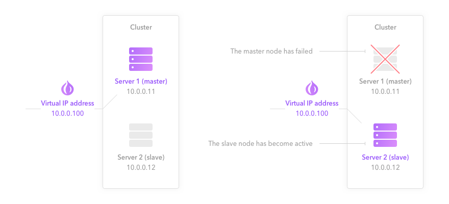
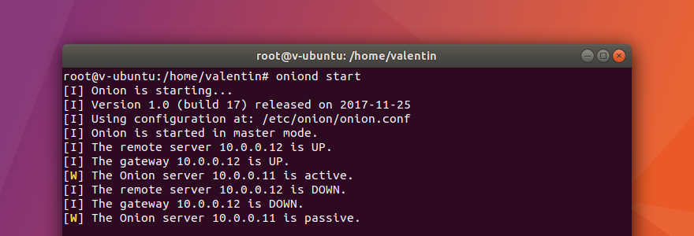
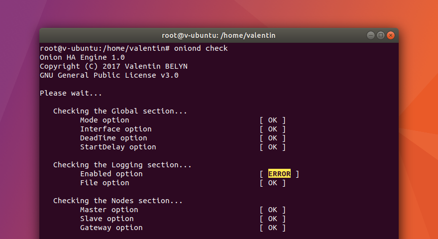
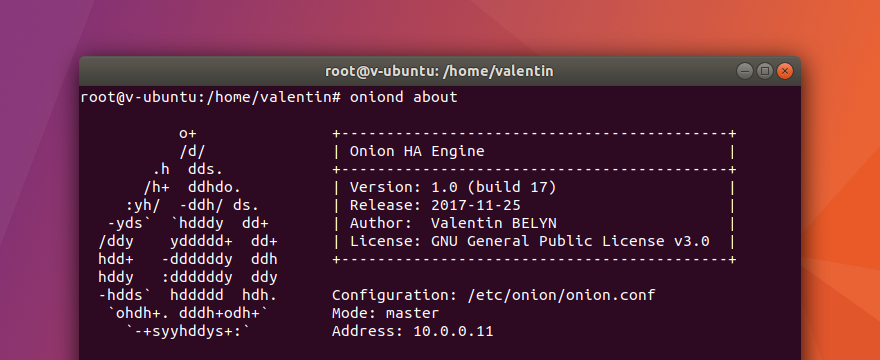

<div>
    <h1 align="center">Onion HA</h1>
    <p align="center">Onion is a new way to add high availability (HA) to your server cluster. Onion is easy to use, fast and reliable. It is the perfect alternative to the deceased Heartbeat.</p>
    <p align="center">You can also use Onion in many other cases!</p>
</div>
<br>
<p align="center">
    
</p>
<br>

## Table of contents

- [Features](#features)
- [How does it work?](#how-does-it-work)
- [Getting started](#getting-started)
  - [Requirements](#requirements)
  - [Installation](#installation)
  - [Configuration](#configuration)
  - [Interacting with Onion](#interacting-with-onion)
  - [Beware! Firewall rules and ARP cache](#beware-firewall-rules-and-arp-cache)
- [Contributing](#contributing)
- [Thanks](#thanks)
- [License](#license)

## Features

- **Simple:** Easy to install and manage.
- **Fast:** Onion is optimized for performance. It can switch the shared virtual IP address in a second between two servers.
- **Efficient:** Onion not only detects whether the remote server is dead, but it also ensures that the current server can be reached without latency.
- **Powerful and flexible:** When a server fails, Onion is able to execute your Bash, Python, Perl and other scripts. This gives you a glimpse of its possibilities in the field of high availability.
- **Reliable.**

## How does it work?

Onion works in master/slave mode in a cluster of two nodes.
Onion sends ICMP requests to detect if the remote server is alive. It also monitors equipment status in front of the server to make sure that it is always reachable with minimal latency.

> ICMP requests are sent every second to the remote server and the gateway (trustworthy equipment). HSRP, VRRP and GLBP protocols are supported.

By default, only the master node is active. If it goes down or if an equipment in front of it fails, the slave node becomes active.



When a server status changes (active to passive — if the server is still alive but an equipment in front of it is dead — or passive to active), Onion runs your scenarios. A scenario is a command or a script (Bash, Python, Perl, etc.).
For example, you can add a virtual IP address to the active node and remove it from the passive node to add a high availability to your cluster. You can do everything with Onion! :+1:

## Getting started

> Onion needs to be installed and configured on your two nodes.

### Requirements

- Python 3.6 or better.
- Debian, Ubuntu, CentOS and Red Hat are officially supported (but you can use another distribution).

### Installation

You must install Python 3.6+ before installing Onion:
```
apt-get update
apt-get install python3
```

Check if you have a version >= 3.6:
```
python3 -V
```

> If not, Python 3.6 (or better) is not in the repositories of your distribution. You should upgrade your operating system to the latest version or manually add an external repository.

Download and install Onion:
```
wget https://github.com/ValentinBELYN/OnionHA/archive/master.tar.gz
tar -xzf master.tar.gz
cd OnionHA-master/setup
chmod +x setup.py
./setup.py install
```

> setup.py options are: install, uninstall, update, license and help.

### Configuration

Onion is very easy to configure. Simply edit its configuration file located at `/etc/onion/onion.conf` on your nodes. Settings are identical except the `mode` option and eventually the `interface` option.

```ini
# Global settings
[global]
  mode:       master                 # master or slave node
  interface:  ens33
  deadTime:   2                      # failure (death) detection time (in seconds)
  initDelay:  0                      # delay before starting Onion (in seconds)

# Logging
[logging]
  enabled:    yes                    # enable or disable logging ('yes' or 'no')
  file:       /var/log/onion.log     # logging file (if enabled: yes)

# Cluster nodes
[nodes]
  master:     10.0.0.11              # master address (IP or FQDN)
  slave:      10.0.0.12              # slave address (IP or FQDN)

  # Trustworthy equipment
  gateway:    10.0.0.1               # gateway address (can be the HSRP, VRRP
                                     # or GLBP IP address)

# Your scenarios
# Below, a virtual IP address is shared between two servers:
# only the active server has the virtual IP address (10.0.0.100) while the passive
# server has nothing
[scenarios]
  active:     ip address add 10.0.0.100/24 dev ens33
  passive:    ip address del 10.0.0.100/24 dev ens33

# If you want to add your own scripts, use instead:
# active:     /yourpath/onion-active.sh
# passive:    /yourpath/onion-passive.sh
```

Save and run this command to check your current configuration:
```
oniond check
```

If there is no error, you can start Onion in an interactive mode (to test):
```
oniond start
```

... or start it as a daemon:
```
systemctl start onion
```

### Interacting with Onion

Start Onion in interactive mode:
```
oniond start
```



Check the Onion node configuration:
```
oniond check
```



Output the version of the Onion node:
```
oniond version
```

Display all information about the daemon:
```
oniond about
```



Display a help message:
```
oniond help
```

Start, stop and restart Onion:
```
systemctl start onion
systemctl stop onion
systemctl restart onion
```

Check the node status:
```
systemctl status onion
```

### Beware! Firewall rules and ARP cache

Be careful when setting up Onion. Configure your firewall rules (on servers and routers) to allow ICMP requests and replies between your servers and routers.

Furthermore, ARP cache of routers may affect Onion's performance. Decrease their refresh time — if possible — (to 5 seconds, 20 seconds or several minutes according to your needs) to quickly take into account the new virtual IP address/physical MAC address association in case of a server failure.

## Contributing

Onion is the result of many months of work. From its conception to development, it has been fully developed on my free time. If you want to contribute to its development, you can buy me a :beer: [by making a donation](https://paypal.me/ValentinBELYN) :)

[(Donate with PayPal)](https://paypal.me/ValentinBELYN)

You can also contribute by making suggestions to improve Onion and make it known.
Onion is nothing without you!

## Thanks

- Special thanks to Vincent LOUBRY for supporting the project and his good ideas.

## License

Onion is being developed by Valentin BELYN.
It has been released under the GNU General Public License v3.0. See the [LICENSE](LICENSE) file for details.

Copyright (C) 2018 Valentin BELYN. All rights reserved.
