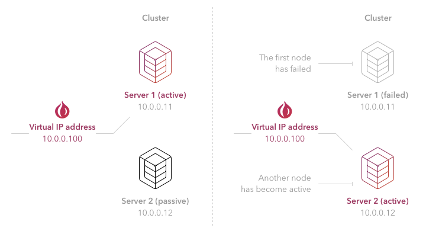
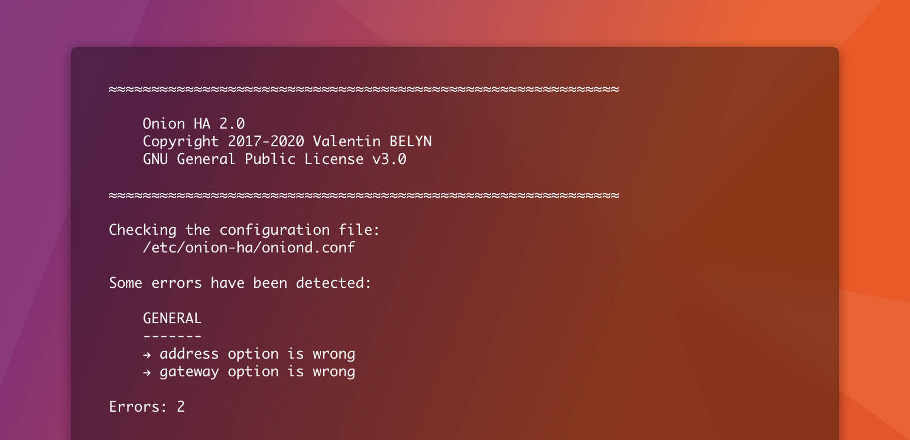
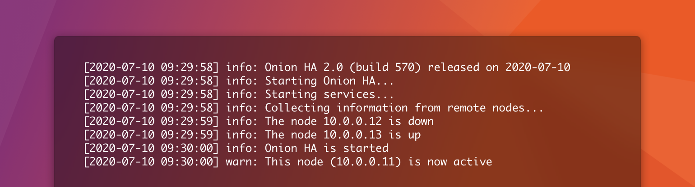
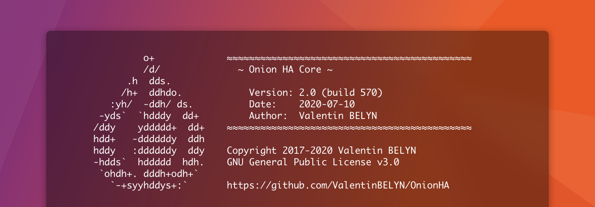

<div align="center">
  <br>
  
  <h2>Onion HA</h2>
  <p>Onion HA is a simple way to add high availability to a cluster. In its latest version, Onion HA becomes more powerful, faster and reliable than ever, and can support an unlimited number of nodes.</p>
  <p>Configure the cluster according to your needs and run your own scripts when a node becomes active or passive.</p>
</div>

<br>

## Features

- :deciduous_tree: **Simple:** Easy to install and manage. You can build a highly available cluster in minutes.
- :rocket: **Fast:** Onion HA is optimized to provide the best performance and reduce downtime. It can switch the shared virtual IP address in a second between your nodes.
- :zap: **Powerful:** Onion HA runs your own scripts when a node becomes active or passive. This gives you the opportunity to do what you want, such as adding/removing a virtual IP address, starting/stopping a service or mounting/unmounting a disk.
- :muscle: **Scalable:** Onion HA can operate on a large number of nodes. Whether you have two nodes or ten nodes, Onion HA will work the same way.
- :nut_and_bolt: **Reliable:** Each piece of code has been studied and tested individually in different environments to ensure reliability.
- :butterfly: **Lightweight:** Onion HA is incredibly light and has no impact on the performance of your servers.

<br>

## How does it work?

Onion HA works in an active/passive mode. Passive nodes act as backup servers ready to take over as soon as the active server is no longer reachable. In the event of failure of the active node, a new one is elected from among the operational passive nodes. If a virtual IP address is configured, it automatically switches to the new active node.

All nodes are monitored in real time to detect any problem. See the [Firewall rules and ARP cache](#firewall-rules-and-arp-cache) section to learn more about the ports to allow in your firewalls.

<br>

<div align="center">
  
</div>

<br>

Onion HA gives you the opportunity to create your own scripts when the status of a node changes. These scripts, called *actions*, can be written in your favorite programming language (Bash, Python, Perl, etc.). For example, you can add a virtual IP address to the active node and remove it from the passive nodes to add high availability to your cluster.

<br>

## Installation

In this section, you will find how to install Onion HA on your nodes. An Onion HA cluster requires at least two nodes and can operate up to ten nodes (maximum recommended).

Before continuing, make sure your nodes meet the following prerequisites:

- Python 3.6 or higher is installed.
- The Python Package Installer (pip3) is installed.
- Debian, Ubuntu, Red Hat and CentOS are officially supported but you can use another distribution.

To download and install Onion HA on your nodes, enter the commands below:

```shell
wget -qO- https://github.com/ValentinBELYN/OnionHA/archive/v2.0.0.tar.gz | tar -xzf -
cd OnionHA-2.0.0/setup
chmod +x setup.sh
sudo ./setup.sh install
```

To update or remove Onion HA, repeat the previous steps by replacing the `install` command by `update` or `remove`. You can display a help message by typing `./setup.sh help`.

<br>

## Configuration

Onion HA is easy to configure. Edit its configuration file located at `/etc/onion-ha/oniond.conf` on your nodes. Settings are the same for all your nodes except in the `general` section:

```ini
# ---------------------------------------------------------------------
# Configure the general settings of this node.
# You can define an IP address or a fully qualified domain name (FQDN)
# for each option requiring an address.
# ---------------------------------------------------------------------
[general]
  # The IP address or FQDN of this node.
  address:      10.0.0.11

  # The gateway address is required to verify the network connectivity
  # (configure your gateway to allow ICMP).
  gateway:      10.0.0.1

  # The initDelay directive is used to delay the start of Onion HA to
  # ensure that the system services are operational (in seconds).
  initDelay:    0

# ---------------------------------------------------------------------
# Configure the logging settings of this node.
# You can set the verbosity level to info, warning or error.
# ---------------------------------------------------------------------
[logging]
  enable:       true
  level:        info
  file:         /var/log/oniond.log

# ---------------------------------------------------------------------
# Configure the cluster settings.
# Share the configuration of this section between your nodes.
# ---------------------------------------------------------------------
[cluster]
  # The listening port of the cluster nodes, including this server.
  port:         7500

  # The deadTime directive is used to specify how long Onion HA should
  # wait before considering a node as dead (in seconds).
  deadTime:     2

  # The IP address or FQDN of the nodes, including this node.
  # The order of the nodes is important: in case of failure, their
  # order is used to determine the new active node. The first node of
  # this list is the master node and is active by default.
  nodes:        10.0.0.11
                10.0.0.12
                10.0.0.13

# ---------------------------------------------------------------------
# Configure the scripts to execute when the node status changes.
# You can specify the absolute path of your scripts or define command
# lines.
# Share the configuration of this section between your nodes (unless
# you want different actions on each host).
# ---------------------------------------------------------------------
[actions]
  active:       ip address add 10.0.0.100/24 dev ens32
  passive:      ip address del 10.0.0.100/24 dev ens32

# If you want to use your scripts, make sure they are executable and
# you have entered their absolute path as follows:
#
# [actions]
#   active:     /etc/onion-ha/actions/active.sh
#   passive:    /etc/onion-ha/actions/passive.sh
```

> **Warning:** If you use your own scripts, restrict their access to the root user only.

Run this command to check your current configuration and make sure there are no errors:

```shell
oniond check
```

<div align="center">
  
</div>

<br>

## Getting started

Well done! Your nodes are now configured. In this section, you will find how to start Onion HA and interact with it.

Before starting Onion HA as a daemon, use the command below to start Onion HA in an interactive mode (to test):

```shell
oniond start
```

<div align="center">
  
</div>

<br>

> Press Ctrl+C to stop it.

If the behavior of your nodes is as expected, you can start Onion HA in the background, as a daemon:

```shell
systemctl start onion-ha
```

You can stop or restart it with these commands:

```shell
systemctl stop onion-ha
systemctl restart onion-ha
```

By default, Onion HA starts with your servers. You can deactivate this behavior at any time (not recommended):

```shell
systemctl disable onion-ha
```

To preview the status of your cluster, type in your terminal:

```shell
oniond status
```

<div align="center">
  
</div>

<br>

To show all information about the daemon:

```shell
oniond version
oniond about
```

<div align="center">
  
</div>

<br>

To show a help message:

```shell
oniond help
```

For each command, you can specify the `config` option to select another configuration file:

```shell
oniond start --config /path/oniond.conf
```

<br>

## Firewall rules and ARP cache

Onion HA nodes use the `UDP` port `7500` by default. This port can be changed in the configuration file. Make sure that the firewall of your nodes does not prevent communication on the port used. Furthermore, the nodes must be able to contact the gateway using the `ICMP` protocol to check the connectivity.

Finally, the ARP cache of the gateway can affect the performance of Onion HA. It is recommended to decrease its timeout to 15 seconds, 30 seconds or several minutes according to your needs, to quickly take into account the new virtual IP address/physical MAC address association in case of a node failure and reduce downtime.

## Contributing

Comments and enhancements are welcome.

All development is done on [GitHub](https://github.com/ValentinBELYN/OnionHA). Use [Issues](https://github.com/ValentinBELYN/OnionHA/issues) to report problems and submit feature requests. Please include a minimal example that reproduces the bug.

## Donate

Onion HA is completely free and open source. It has been fully developed on my free time. If you enjoy it, please consider donating to support the development.

- [:tada: Donate via PayPal](https://paypal.me/ValentinBELYN)

## License

Copyright 2017-2020 Valentin BELYN.

Code released under the GNU GPLv3 license. See the [LICENSE](LICENSE) for details.
